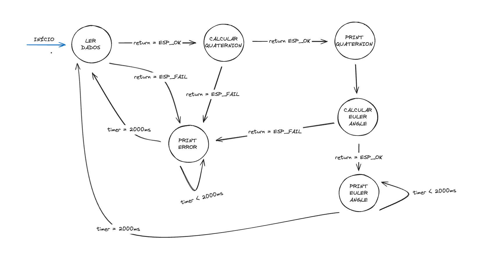

# 🚀 Projeto SE 2024.1

## 👥 Equipe

- Lucas Bivar Fonseca Tavares
- João Victor Negreiros da Silva
- Luís Henrique Lima Santos
- Lucas Alves Fidelis Araújo
- Lohan Yrvine Oliveira Pinheiro

## 📝 Sobre o Projeto

### 🎯 Itens a Serem Entregues

- 🧩 Firmware contendo um exemplo de utilização da biblioteca.
- 🖼️ Máquina de estado do firmware.
- 📚 Documentação da biblioteca.
- 🏗️ Diagrama de bloco para o protótipo do hardware.
- 🛠️ Esquemático do hardware.

## 📚 Descrição da Biblioteca

### 📁 Componente `imu_tools.h`

Esta biblioteca fornece funções para calcular as três variáveis dos ângulos de Euler e as quatro do quaternion a partir dos dados de um sensor IMU.

#### 🏗️ Estruturas

- `Quaternion`: Representa um quaternion.
- `EulerAngle`: Representa os ângulos de Euler.
- `IMUData`: Representa os dados do IMU 6DOF.

#### 📊 Funções

- `esp_err_t imu_read_data(IMUData *data)`: Obtém os dados do sensor IMU e armazena na estrutura `IMUData`. Retorna `ESP_OK` em caso de sucesso ou `ESP_FAIL` se ocorreu falha na inicialização.
- `esp_err_t imu_calculate_quaternion(const IMUData *data, Quaternion *quaternion)`: Calcula o quaternion com base nos dados do sensor IMU fornecidos e armazena o resultado na estrutura `Quaternion`. Retorna `ESP_OK` em caso de sucesso ou `ESP_FAIL` se ocorreu falha na inicialização.
- `esp_err_t imu_calculate_euler_angles(const Quaternion *quaternion, EulerAngle *euler)`: Calcula os ângulos de Euler a partir do quaternion fornecido e armazena o resultado na estrutura `EulerAngle`. Retorna `ESP_OK` em caso de sucesso ou `ESP_FAIL` se ocorreu falha na inicialização.

### 📁 Componente `sensor_imu.h`

Esta camada de abstração é utilizada entre a biblioteca `imu_tools.h` e o sensor inercial, de onde serão obtidos os dados de aceleração e giroscópio.

#### 🏗️ Estruturas

- `AccelerationData`: Representa os dados de aceleração.
- `GyroscopeData`: Representa os dados do giroscópio.

#### 📊 Funções

- `esp_err_t imu_init(uint8_t devAddr, gpio_num_t sda_pin, gpio_num_t scl_pin)`: Verifica se o sensor IMU está conectado e o inicializa passando o endereço I2C e as GPIOs utilizadas. Retorna `ESP_OK` em caso de sucesso ou `ESP_ERR_NOT_FOUND` se ocorreu falha na inicialização.
- `esp_err_t imu_get_acceleration_data(AccelerationData *data)`: Obtém os dados de aceleração do sensor inercial e armazena-os na estrutura `AccelerationData`. Retorna `ESP_OK` em caso de sucesso ou `ESP_FAIL` se ocorreu falha na inicialização.
- `esp_err_t imu_get_gyroscope_data(GyroscopeData *data)`: Obtém os dados do giroscópio do sensor inercial e armazena-os na estrutura `GyroscopeData`. Retorna `ESP_OK` em caso de sucesso ou `ESP_FAIL` se ocorreu falha na inicialização.
- `esp_err_t imu_deinit()`: Desabilita a comunicação I2C e libera os recursos. Retorna `ESP_OK` em caso de sucesso ou `ESP_FAIL` se ocorreu falha na inicialização.

## 🖼️ Diagrama de Bloco do Protótipo do Hardware

## 🛠️ Esquemático do Hardware

## 🖼️ Máquina de Estados

