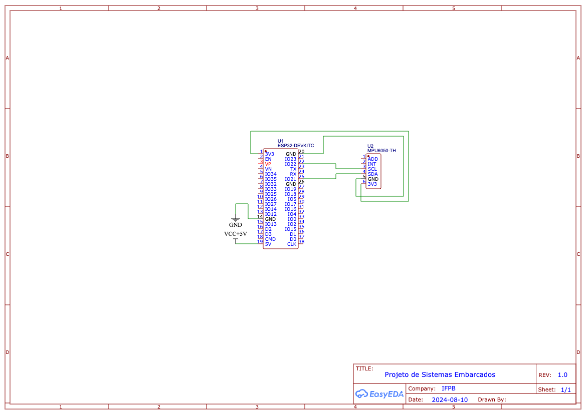
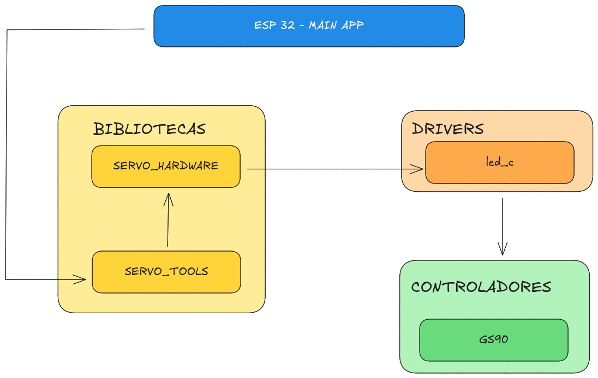

# 🚀 Projeto SE 2024.1

## 👥 Equipe

- Lucas Bivar Fonseca Tavares
- João Victor Negreiros da Silva
- Luís Henrique Lima Santos
- Lucas Alves Fidelis Araújo
- Lohan Yrvine Oliveira Pinheiro

## 📝 Sobre o Projeto

### 🎯 Itens a Serem Entregues

- 🧩 Firmware contendo um exemplo de utilização da biblioteca.
- 🖼️ Máquina de estado do firmware.
- 📚 Documentação da biblioteca.
- 🏗️ Diagrama de bloco para o protótipo do hardware.
- 🛠️ Esquemático do hardware.

## 📚 Descrição da Biblioteca

### 📁 Estrutura de pastas

```txt
TODO
```

### 📁 Componente `servo_tools.h`

Biblioteca chamada `servo_tools.h` que tem como finalidade o controle do ângulo do servomotor.

#### 🏗️ Estruturas

- `ServoConfig`: Representa os dados de configuração do servo motor.
- `ServoAngle`: Representa os dados do ângulo atual do servo motor.

#### 📊 Funções

- `esp_err_t servo_init(ServoConfig *config)`: Inicializa o servomotor com base na configuração fornecida (pino GPIO, frequência PWM, etc.).
- `esp_err_t servo_set_angle(ServoConfig *config, ServoAngle angle)`: Define o ângulo do servomotor, movendo o braço acoplado ao rotor para a posição desejada.
- `esp_err_t servo_get_angle(const ServoConfig *config, ServoAngle *angle)`: Obtém o ângulo atual do braço do servomotor.

### 📁 Camada de abstração `servo_hw.h`

Camada de abstração utilizada para a comunicação entre a biblioteca `servo_tools.h` e o servomotor. Essa camada será responsável pelo controle dos sinais PWM que determinam a posição do servomotor.


#### 📊 Funções

- `esp_err_t hw_servo_init(uint8_t gpio_num)`: Inicializa o GPIO para a geração do sinal PWM usado no controle do servo. Na inicialização do servo o mesmo deve fazer uma varredura iniciando o ângulo 0 (zero) indo até o ângulo máximo do servo e voltando para o ângulo 0.

- `esp_err_t hw_servo_set_pulse_width(uint8_t gpio_num, uint32_t pulse_width_us)`: Define a largura de pulso (em microsegundos) para controlar o ângulo do servomotor..
- `esp_err_t hw_servo_deinit(uint8_t gpio_num)`: Desabilita o PWM no GPIO especificado e libera os recursos utilizados..

## 🖼️ Diagrama de Bloco do Protótipo do Hardware


## 🛠️ Esquemático do Hardware



## 🖼️ Máquina de Estados


## 🏗️ Arquitetura



## Como Configurar o Wokwi no VSCode e Rodar a Simulação

### Instalação da Extensão

1. **Instalar a Extensão Wokwi**: Primeiro, você precisa instalar a extensão "Wokwi for VS Code" no seu ambiente de desenvolvimento. Para fazer isso, abra o Visual Studio Code, vá até a aba de extensões (`Ctrl+Shift+X` ou `Command+Shift+P`), procure por "Wokwi" e instale a extensão oficial do Wokwi.

### Solicitação de Licença

2. **Solicitar uma Nova Licença**: Depois de instalar a extensão, pressione `F1` para abrir a paleta de comandos e selecione "Wokwi: Request a new License". O VS Code irá pedir para confirmar a abertura do site do Wokwi no seu navegador. Confirme clicando em "Open". Em seguida, clique no botão que diz "GET YOUR LICENSE". Você pode ser solicitado a fazer login na sua conta do Wokwi. Se você ainda não tem uma, pode criar gratuitamente. O navegador solicitará confirmação para enviar a licença para o VS Code. Confirme novamente (você pode ter que confirmar duas vezes, uma vez no navegador e outra vez no VS Code). Você verá uma mensagem no VS Code que diz "License activated for [your name]".

### Iniciar a Simulação

3. **Iniciar a Simulação com `diagram.json`**:
   - Navegue até a pasta do seu projeto no VSCode.
   - Procure pelo arquivo `diagram.json`.
   - Abra o arquivo `diagram.json`.
   - Com a simulação do seu projeto carregada, será possivel iniciar a simulação.

#### Alternativa Online

Se, por algum motivo, a configuração local não funcionar, você ainda pode acessar o Wokwi online através do seguinte link:

TODO


## Demonstração

TODO
