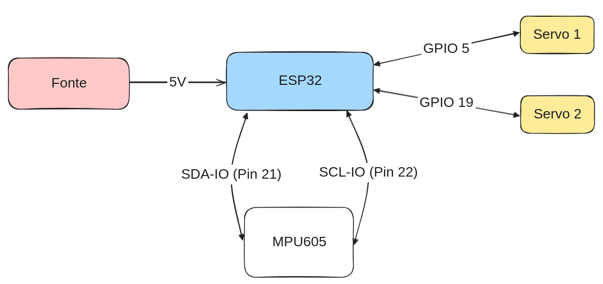
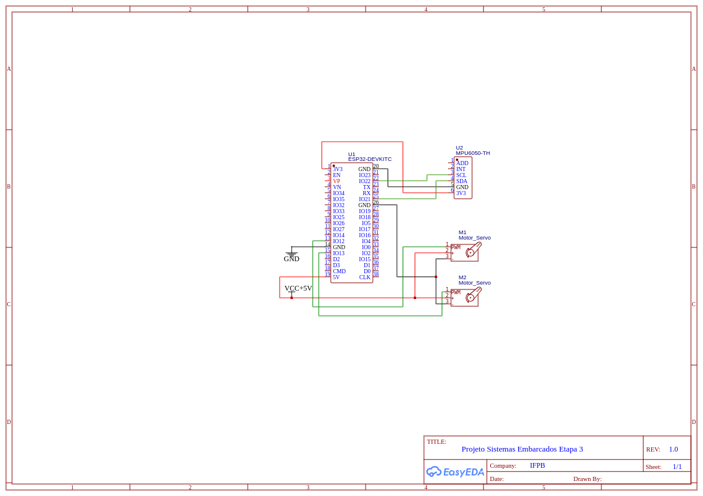
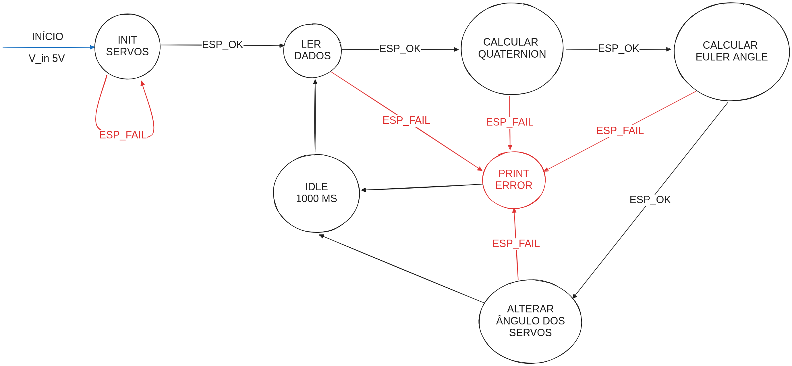
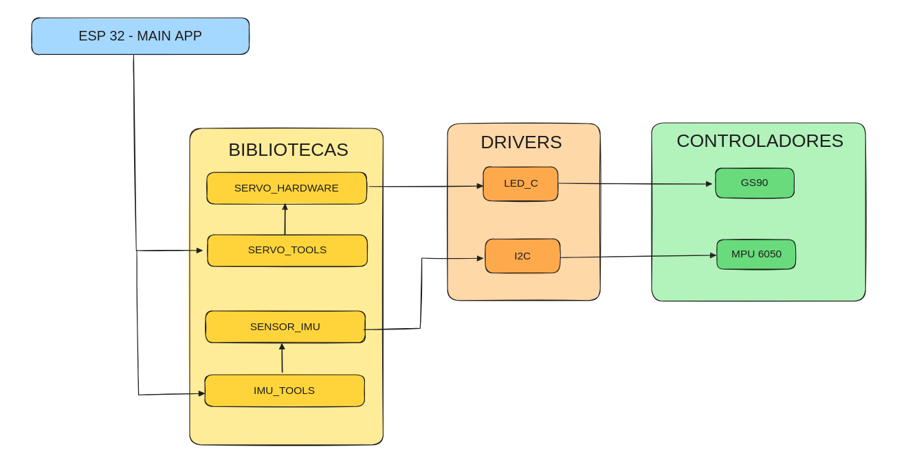

# 🚀 Projeto SE 2024.1

## 👥 Equipe

- Lucas Bivar Fonseca Tavares
- João Victor Negreiros da Silva
- Luís Henrique Lima Santos
- Lucas Alves Fidelis Araújo
- Lohan Yrvine Oliveira Pinheiro

## 📝 Sobre o Projeto

Esse projeto unifica, as bibliotecas do servo motor, que são `servo_hw` e `servo_tools`, com as bibliotecas do MPU6050, que são `imu_tools` e `sensor_imu`.
O objetivo é que o os servo motores sejam controlados pelo MPU6050, ou seja, o MPU6050 irá captar os dados do giroscópio e com base nesses dados, o servo motor irá se mover.

### 🎯 Itens a Serem Entregues

- 🧩 Firmware contendo um exemplo de utilização da biblioteca.
- 🖼️ Máquina de estado do firmware.
- 📚 Documentação da biblioteca.
- 🏗️ Diagrama de bloco para o protótipo do hardware.
- 🛠️ Esquemático do hardware.

## 📚 Descrição da Biblioteca

Na Etapa 3 foi realizada uma junção das bibliotecas construídas na etapa 1 e 2. Nosso grupo 4 ficou responsável por unir a biblioteca do MPU desenvolvida pelo Grupo 2 (https://github.com/GabrielAlbinoo/embarcados), e a biblioteca do Servo Motor desenvolvida pelo Grupo 1 (https://github.com/Marcelo-RSilva/biblioteca_servo_motor_esp_idf?authuser=0).

### Relatório da Etapa 3

#### Uso das Bibliotecas de Servo Motor e MPU6050

A biblioteca do servo motor funcionou corretamente de acordo com o esperado.
Já a biblioteca do MPU6050 não funcionou corretamente, pois não conseguimos fazer a leitura correta dos dados do MPU.
Devido a isso, tivemos que corrigir a biblioteca do MPU6050 para que ela funcionasse corretamente, incluindo alterações na interface original da biblioteca.

#### Delay após definir ângulo do servo

Foi utilizado um delay de 1000ms para que o servo motor se movimentasse. Isso se deve ao fato de que o servo motor não consegue se movimentar rapidamente, então é necessário um tempo para que ele se movimente.

### 📁 Estrutura de pastas

```txt
build/
components/
    imu_tools/
        include/
        CMakeLists.txt
        imu_tools.c
    sensor_imu/
        include/
        CMakeLists.txt
        sensor_imu.c
    servo_hw/
        include/
        CMakeLists.txt
        servo_hw.c
    servo_tools/
        include/
        CMakeLists.txt
        servo_tools.c
main/
    CMakeLists.txt
    main.c
CMakeLists.txt
diagram.json
sdkconfig
sdkconfig.ci
sdkconfig.old
wokwi.toml
README.md

```

## 🖼️ Diagrama de Bloco do Protótipo do Hardware



## 🛠️ Esquemático do Hardware



## 🖼️ Máquina de Estados



## 🏗️ Arquitetura



## Como Configurar o Wokwi no VSCode e Rodar a Simulação

### Instalação da Extensão

1. **Instalar a Extensão Wokwi**: Primeiro, você precisa instalar a extensão "Wokwi for VS Code" no seu ambiente de desenvolvimento. Para fazer isso, abra o Visual Studio Code, vá até a aba de extensões (`Ctrl+Shift+X` ou `Command+Shift+P`), procure por "Wokwi" e instale a extensão oficial do Wokwi.

### Solicitação de Licença

2. **Solicitar uma Nova Licença**: Depois de instalar a extensão, pressione `F1` para abrir a paleta de comandos e selecione "Wokwi: Request a new License". O VS Code irá pedir para confirmar a abertura do site do Wokwi no seu navegador. Confirme clicando em "Open". Em seguida, clique no botão que diz "GET YOUR LICENSE". Você pode ser solicitado a fazer login na sua conta do Wokwi. Se você ainda não tem uma, pode criar gratuitamente. O navegador solicitará confirmação para enviar a licença para o VS Code. Confirme novamente (você pode ter que confirmar duas vezes, uma vez no navegador e outra vez no VS Code). Você verá uma mensagem no VS Code que diz "License activated for [your name]".

### Iniciar a Simulação

3. **Iniciar a Simulação com `diagram.json`**:
   - Navegue até a pasta do seu projeto no VSCode.
   - Procure pelo arquivo `diagram.json`.
   - Abra o arquivo `diagram.json`.
   - Com a simulação do seu projeto carregada, será possivel iniciar a simulação.


## Demonstração

https://youtu.be/kv1JMMXrvTU
